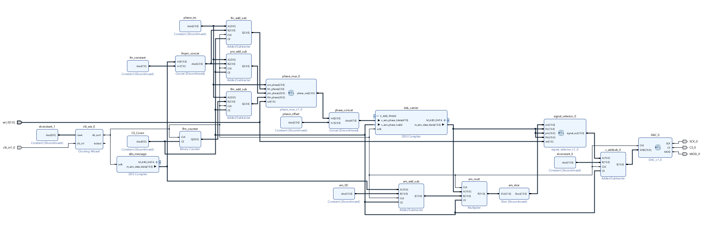

# FPGA-Based Reconfigurable Multi-Modulation Signal Generator

## Overview

A reconfigurable FPGA-based multi-modulation signal generator implemented using Direct Digital Synthesis (DDS). The system supportsMulti-Modulation waveform generation through a shared hardware architecture and dynamic waveform selection.

### Supported Modulation Schemes

- Amplitude Modulation (AM)
- Frequency Modulation (FM)
- Phase Modulation (PM)
- Linear Frequency Modulation (LFM/Chirp)

## Features

- DDS-based waveform generation
- Reconfigurable FPGA architecture
- Dynamic modulation selection
- Shared hardware resource utilization
- Real-time signal synthesis
- Hardware validation using DAC and CRO

## Tools & Technologies

- FPGA
- Verilog HDL
- VHDL
- Xilinx Vivado
- MATLAB
- FPGA Development Board
- Direct Digital Synthesis (DDS)

## Architecture

## Results

### HDL Simulation Results

#### Amplitude Modulation (AM)

#### Frequency Modulation (FM)

#### Phase Modulation (PM)

#### Linear Frequency Modulation (LFM)

---

### Hardware Validation (CRO Results)

#### AM Output

#### FM Output

#### PM Output

#### LFM Output

## Future Enhancements

- Multi-Tone Signal
- BPSK implementation
- QPSK implementation
- QAM implementation
- OFDM waveform generation
- SDR integration

## Author

Supreeth K

M.Tech Embedded Systems | FPGA | Verilog HDL | Digital Design
